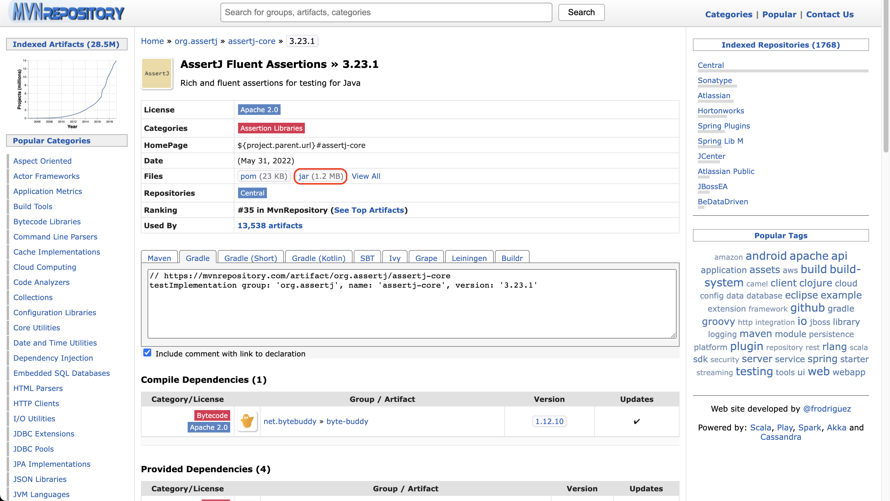

# Junit

## 목차

---

- Junit
- Setting
- AssertJ, Hamcrest Lib 추가
- Annotation
- LifeCycle

---

<br/><br/><br/>

### Junit

---

- 자바 진영의 테스트 프레임워크 이다.
- Junit 5 기준 프레임워크 구조
    - Jupiter
        - Junit 5 제공
    - Vintage
        - Junit 이전 버전 제공
    - Junit Platform
        - 테스트 런처 제공

[[이미지 참고 자료]](https://freecontent.manning.com/junit-5-architecture/)


<br/><br/><br/>

### Setting

---

> 세팅은 JetBrain 회사의 IntelliJ IDE 툴로 진행한다.

<br/>

- src가 존재하는 경로에 test 디렉토리를 생성한다.


<br/>

- Project Structure에 들어간다.
- Project Settings -> Modules -> 생성한 test 디렉토리의 상위 디렉토리 선택
- 생성한 test 디렉토리 선택 -> Mark as: 에서 Tests 디렉토리 선택 -> APPLY -> OK


<br/>

- 패키지 구조에 test 디렉토리가 초록색으로 표기 되면 테스트 디렉토리 구성 완료


<br/>

- test 디렉토리에 TestClass를 생성
- Assertions문 작성 후 junit 관련 라이브러리 다운
    - apiguardian-api-version.jar
    - junit-jupiter-version.jar
    - junit-jupiter-api-version.jar
    - junit-jupiter-engine-version.jar
    - junit-jupiter-params-version.jar
    - junit-platfrom-commons-version.jar
    - junit-platfrom-engine-version.jar
    - opentest4j-version.jar
- 테스트 케이스 생성 후 잘 작동 되는지 확인


<br/><br/><br/>

### AssertJ, Hamcrest Lib 추가

---

> Lib 추가는 JetBrain 회사의 IntelliJ IDE 툴로 진행한다.

<br/>

- 우선 Maven Repository 사이트를 소개 한다.
- 개발에 필요한 각종 라이브러리를 찾아볼 수 있다.
  - https://mvnrepository.com/

<br/>

- Assertj 라이브러리를 검색 한다.
  - AssertJ Fluent Assertions
  - org.assertj » assertj-core
  - Rich and fluent assertions for testing for Java

- Hamcrest 라이브러리를 검색한다.
  - Hamcrest
  - org.hamcrest » hamcrest
  - Core API and libraries of hamcrest matcher framework.


<br/>

- Assertj 버전을 선택 한다.
- Hamcrest 버전을 선택 한다.


<br/>

- 해당 버전을 jar 파일로 다운 받는다.



<br/>

- IDE에서 file -> project structure창에 들어 간다.


<br/>

- Project Settings
  - Modules
    - 프로젝트 폴더
      - Dependencies
        - '+' 버튼
          - JARs or Directories...


<br/>

- Maven Repository에서 받은 Assertj 라이브러리 추가
- Maven Repository에서 받은 Hamcrest 라이브러리 추가
- Compile -> Test로 변경
- Apply 후 OK


<br/><br/><br/>

### Annotation

---

> JUnit 기본 어노테이션

- 메서드 위에 선언 한다.
- 목적에 맞도록 사용 한다.

| Annotation  | 설명                                        |
|:------------|:--------------------------------------------|
| @BeforeAll  | 전체 테스트가 실행될 때 딱 한번 실행 된다.  |
| @AfterAll   | 전체 테스트가 종료될 때 딱 한번 실행 된다.  |
| @BeforeEach | 각각의 테스트가 진행될 때 실행 된다.        |
| @AfterEach  | 각각의 테스트가 종료될 때 실행 된다.        |
| @Test       | 각각의 테스트를 진행할 때 작성해 준다.      |
| @Disabled   | 해당 테스트 케이스는 테스트에서 제외 시킨다.|

더 자세한 Annotation 정보는 아래 사이트에서 확인 가능
- https://junit.org/junit5/docs/current/user-guide/#writing-tests-annotations

<br/><br/><br/>

### LifeCycle

---

- BeforeAll -> BeforeEach -> Test -> AfterEach -> AfterAll 순서로 진행된다.
- BeforeAll, AfterAll 선언시 앞쪽에 static 키워드가 있어야 한다.
  - static void BeforeAll() { }
  - static void AfterAll() { }
- 각 테스트 케이스별 BeforeEach -> Test -> AfterEach가 실행 된다.

```java
package junit;

import org.junit.jupiter.api.*;
import org.junit.jupiter.api.Assertions.*;

public class JunitTest {

    @BeforeAll
    static void beforeAll() {
        System.out.println(" @BeforeAll : 전체 테스트에서 처음 한번만 실행 된다.");
    }

    @AfterAll
    static void afterAll() {
        System.out.println("  @AfterAll : 전체 테스트에서 마지막 한번만 실행 된다.");
    }

    @BeforeEach
    void beforeEach() {
        System.out.println("@BeforeEach : 테스트에서 각 테스트가 진행될 때  실행 된다.");
    }

    @AfterEach
    void afterEach() {
        System.out.println(" @AfterEach : 테스트에서 각 테스트가 종료될 때  실행 된다.");
    }

    @Test
    void test() {
        System.out.println("      @Test : 테스트 케이스");
    }

    @Test
    @Disabled
    void test2() {
        // void junit.JunitTest.test2() is @Disabled
        System.out.println("@Disabled : 테스트에서 제외 시킨다.");
    }
}
// =============================================================================
//  @BeforeAll : 전체 테스트에서 처음 한번만 실행 된다.
// @BeforeEach : 테스트에서 각 테스트가 진행될 때  실행 된다.
//       @Test : 테스트 케이스
//  @AfterEach : 테스트에서 각 테스트가 종료될 때  실행 된다.
// void junit.JunitTest.test2() is @Disabled
//   @AfterAll : 전체 테스트에서 마지막 한번만 실행 된다.
```