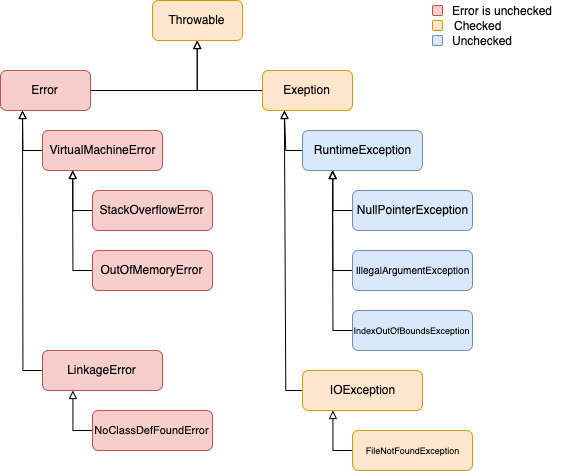

# 예외 처리

## 목차

---

- 자바가 제공하는 예외 계층 구조
- Exception과 Error의 차이
- CheckedException과 UncheckedException
- 예외 처리 이유
- 예외 발생 시키기
- 자바에서 예외 처리 방법 [ try ~ catch ] 
- 자바에서 예외 처리 방법 [ finally ] 
- 자바에서 예외 처리 방법 [ throw ]
- 자바에서 예외 처리 방법 [ throws ]
- 커스텀 예외 만드는 방법

---

<br/><br/><br/>

### 예외 처리 이유

---

개발을 하다 보면 의도치 않은 에러로 프로그램이 종료될 때가 있다.

개발자가 코드를 잘못 작성하거나, 사용자가 프로그램을 신기하게 사용하여  
특정 로직에서 오류가 발생할 수 있기 때문이다.

개발자는 문제의 소지가 될 수 있는 코드에 보완 장치로  
예외 처리를 하여 프로그램이 비정상적인 종료를 당하지 않도록 하거나  
프로그램이 비정상적으로 종료될 뻔한 내용을 기록(로깅)하기 위해  
예외처리를 하게 된다.

<br/><br/><br/>

### 자바가 제공하는 예외 계층 구조

---



<br/><br/><br/>

### Exception과 Error의 차이

---

- Exception
  - 개발자가 구현한 로직에서 에러가 발생 한다.
  - 개발자가 미리 보완하여 처리할 수 있다.
  - Checked Exception, Unchecked Excepion으로 구분 된다.
    - CheckedException과 UncheckedException 목차에서 확인 한다.
- Error
  - java.lang.Error
  - 시스템(JVM)에서 발생 한다.
  - 개발자가 미리 보완할 수 없다.
  - 발생시 시스템 로직은 비정상적으로 종료가 된다.

<br/><br/><br/>

### CheckedException과 UncheckedException

---
> Checked Exception
  - 계층 구조
    - java.lang.Object
      - java.lang.Throwable
        - java.lang.Exception
  - 예외 처리를 필수로 해야 한다.
  - Exception 클래스를 상속 해야 한다.

```java
public class IOException extends Exception {
  
    static final long serialVersionUID = 7818375828146090155L;
  
    public IOException() { super(); }

    public IOException(String message) { super(message); }

    public IOException(String message, Throwable cause) { super(message, cause); }

    public IOException(Throwable cause) { super(cause); }
  
}
```

<br/>

> Unchecked Exception
  - 계층 구조
    - java.lang.Object
      - java.lang.Throwable
        - java.lang.Exception
          - java.lang.RuntimeException
  - 예외 처리를 강제하지 않는다.
  - RuntimeException 클래스를 상속 해야 한다.
  - 개발자의 부주의로 발생한다.

```java
public class NullPointerException extends RuntimeException {
  
    private static final long serialVersionUID = 5162710183389028792L;

    public NullPointerException() { super(); }

    public NullPointerException(String s) { super(s); }
  
}
```

<br/><br/><br/>

### 예외 발생 시키기

---

- 예외 처리를 공부하기 위해 일부러 예외를 발생 시킨다.
- 자바에서 1을 0으로 나누면 ArithmeticException 이 발생 한다.
- 해당 코드를 직접 작성하여 예외 처리가 발생 하는지 확인 한다.
- 프로그램이 비정상적으로 종료된 후에 로직이 작동되는지 확인 한다.
  - 예외가 발생한 후의 로직은 실행 되지 않는다.

```java
int arithmeticException = 1 / 0; // <-- ArithmeticException 발생
System.out.println("예외 발생 이후 로직");
// =============================================================================
// Exception in thread "main" java.lang.ArithmeticException: / by zero
// at exception.ExceptionUsage.main(ExceptionUsage.java:16)
```

<br/><br/><br/>

### 자바에서 예외 처리 방법 [ try ~ catch ]

---

- 예외가 의심되는 부분을 시도(try) 한다.
- 예외를 잡아(catch) 예외에 대한 처리를 한다.
- try 블록 내부 에서는 예외를 대비하기 위한 로직을 작성 한다.
- catch 블록 내부 에서는 예외를 대비한 로직을 작성 한다.
  - 이로 인해 개발자는 비정상적인 프로그램 종료에 대비할 수 있다.

```java
try {
  int arithmeticException = 1 / 0; // <-- ArithmeticException 발생
  System.out.println("예외 발생 이후 로직");
} catch (Exception e) {
  System.out.println("예외를 catch 하였습니다.");
}
// =============================================================================
// 예외를 catch 하였습니다.
```

<br/><br/><br/>

### 자바에서 예외 처리 방법 [ 다중 catch ]

---

- 예외는 여러 유형이 존재 한다.
- catch문으로 각 예외를 유형별로 잡을 수 있다.
- 각 예외마다 실행할 로직을 분리할 수 있다.
  - 개발자는 비정상적인 프로그램 종료에 대한 예외를 상황별로 대처 할 수 있다.
- catch문을 여러번 작성하되 "위에서 아래 방향으로 작은 예외에서 큰 예외로" 작성 한다.

```java
try {
  int arithmeticException = 1 / 0; // <-- ArithmeticException 발생
  System.out.println("예외 발생 이후 로직");
} catch (IllegalArgumentException | IllegalStateException e) {
  System.out.println("IllegalArgumentException 또는 IllegalStateException 예외 발생 !!");
} catch (ArithmeticException e) {
  System.out.println("ArithmeticException 발생 !!");
} catch (Exception e) {
  System.out.println("예외를 catch 하였습니다.");
}
// =============================================================================
// ArithmeticException 발생 !!
```

<br/><br/><br/>

### 자바에서 예외 처리 방법 [ try ~ catch ~ finally ]

---

- 예외를 처리한 후에 필수적으로 처리해주어야 할 로직을 finally 블록에 추가 한다.

```java
try {
  int arithmeticException = 1 / 0; // <-- ArithmeticException 발생
  System.out.println("예외 발생 이후 로직");
} catch (IllegalArgumentException | IllegalStateException e) {
  System.out.println("IllegalArgumentException 또는 IllegalStateException 예외 발생 !!");
} catch (ArithmeticException e) {
  System.out.println("ArithmeticException 발생 !!");
} catch (Exception e) {
  System.out.println("예외를 catch 하였습니다.");
} finally {
  System.out.println("try ~ catch 이후 실행 로직 작성");
}
// =============================================================================
// ArithmeticException 발생 !!
// try ~ catch 이후 실행 로직 작성
```

<br/><br/><br/>

### 자바에서 예외 처리 방법 [ throw ]

---

- throw 키워드를 이용하여 예외를 일부로 발생 시킬 수 있다.
- 특정 조건이나 특수한 상황에서 일부로 예외를 발생 시킬 때 사용 한다.
- createIllegalStateException 메서드는 조건값이 맞으면 일부로 예외를 발생 시키도록 하였다.
  - createIllegalStateException 메서드를 호출하면 IllegalStateException 예외가 발생 한다.

```java
public static void main(String[] args) {
  createIllegalStateException(); 
} // end of main

public static void createIllegalStateException() {
  boolean condition = true;
  if (condition) {
        throw new IllegalStateException(); // <-- IllegalStateException 발생 후 종료
  }
} // end of createIllegalStateException
// =============================================================================
// Exception in thread "main" java.lang.IllegalStateException
// at exception.ExceptionUsage.createIllegalStateException(ExceptionUsage.java:94)
// at exception.ExceptionUsage.main(ExceptionUsage.java:85)
```

<br/><br/><br/>

### 자바에서 예외 처리 방법 [ throws ]

---

- throws 키워드를 이용하여 예외를 호출한 곳으로 되돌려 줄 수 있다.
- throws 키워드는 메소드 끝과 블록 사이에 추가 한다.
- 과정 설명
  - main 메서드에서 createArithmeticException() 메서드를 호출한다.
  - createArithmeticException() 메서드에서 if문의 조건이 참이 되어 ArithmeticException 예외를 발생 시킨다.
  - createArithmeticException() 메서드의 throws 키워드를 확인 후 호출한 곳으로 예외를 되돌려 준다.
  - 호출한 곳에서 catch문으로 해당 예외를 처리 한다.

```java
public static void main(String[] args) {
  try {
    createArithmeticException();   // <-- 호출한 곳에서 예외를 받음 no.2
  } catch(ArithmeticException e) { // <-- 예외를 처리 no.3
    System.out.println("ArithmeticException 발생 !!");
  } catch(Exception e) {
    System.out.println("예외를 catch 하였습니다.");
  }
} // end of main

public static void createArithmeticException() throws ArithmeticException {
  boolean condition = true;
  if (condition) {
    throw new ArithmeticException(); // <-- ArithmeticException 발생 no.1
  }
} // end of createArithmeticException
// =============================================================================
// ArithmeticException 발생 !!
```

<br/><br/><br/>

### 커스텀 예외 만드는 방법

---

- 자바에서 제공하는 Exception 외에도 커스텀 예외를 생성할 수 있다.
- 개발자가 프로그램을 개발함에 있어 특수한 예외 처리를 필요로 할 때 생성 한다.
- 생성 방법
  - 클래스를 생성한 후 Exception 또는 RuntimeException을 상속 받는다.
  - 특수한 상황에 throw 키워드를 사용하여 생성한 예외를 발생 하도록 한다.

```java
// ExceptionCustom class 생성 후 Exception 상속
public class ExceptionCustom extends Exception { }


class Main {
    
  public static void main(String[] args) {
    try {
      createExceptionCustom();  // <-- 호출한 곳에서 예외를 받음 no.2
    } catch (ExceptionCustom e) { // <-- 예외를 처리 no.3
      System.out.println("custom 예외를 catch 하였습니다.");
    } catch (ArithmeticException e) {
      System.out.println("ArithmeticException 발생 !!");
    } catch (Exception e) {
      System.out.println("예외를 catch 하였습니다.");
    }
  } // end of main
  
  public static void createExceptionCustom() throws ExceptionCustom {
      
    boolean condition = true;
    if (condition) {
      throw new ExceptionCustom(); // <-- ExceptionCustom 발생 no.1
    }
    
  } // end of createExceptionCustom
}
// =============================================================================
// custom 예외를 catch 하였습니다.
```

<br/><br/><br/>

### 최종 코드

---

```java
// ExceptionCustom class 생성 후 Exception 상속
public class ExceptionCustom extends Exception { }

/**
 * 자바에서 예외 처리 방법 (try, catch, throw, throws, finally)
 */
public class ExceptionUsage {

    public static void main(String[] args) {

        /**
         * 예외 발생 시키기
         * - 숫자를 나누는 예제
         * - java.lang.ArithmeticException
         */
//        int arithmeticException = 1 / 0; // <-- ArithmeticException 발생
//        System.out.println("예외 발생 이후 로직");
        // =====================================================================
        // Exception in thread "main" java.lang.ArithmeticException: / by zero
        // at exception.ExceptionUsage.main(ExceptionUsage.java:15)
        // =====================================================================


        /**
         * 예외를 try ~ catch로 감싸기
         * - 문제가 되는 코드를 예외 처리 하기
         */
//        try {
//            int arithmeticException = 1 / 0; // <-- ArithmeticException 발생
//            System.out.println("예외 발생 이후 로직");
//        } catch (Exception e) {
//            System.out.println("예외를 catch 하였습니다.");
//        }
        // =====================================================================
        // 예외를 catch 하였습니다.
        // =====================================================================


        /**
         * 다중 catch 테스트
         * - 예외별로 catch 하여 예외를 처리할 수 있다.
         * - catch문은 위에서 아래 방향으로 작은 예외에서 큰 예외로 이동 한다.
         */
//        try {
//            int arithmeticException = 1 / 0; // <-- ArithmeticException 발생
//            System.out.println("예외 발생 이후 로직");
//        } catch (IllegalArgumentException | IllegalStateException e) {
//            System.out.println("IllegalArgumentException 또는 IllegalStateException 예외 발생 !!");
//        } catch (ArithmeticException e) {
//            System.out.println("ArithmeticException 발생 !!");
//        } catch (Exception e) {
//            System.out.println("예외를 catch 하였습니다.");
//        }
        // =====================================================================
        // ArithmeticException 발생 !!
        // =====================================================================


        /**
         * finally로 이후 로직 작성하기
         * - 예외 처리 후 필수적으로 처리해야 할 로직이 있으면 추가 한다.
         */
//        try {
//            int arithmeticException = 1 / 0; // <-- ArithmeticException 발생
//            System.out.println("예외 발생 이후 로직");
//        } catch (IllegalArgumentException | IllegalStateException e) {
//            System.out.println("IllegalArgumentException 또는 IllegalStateException 예외 발생 !!");
//        } catch (ArithmeticException e) {
//            System.out.println("ArithmeticException 발생 !!");
//        } catch (Exception e) {
//            System.out.println("예외를 catch 하였습니다.");
//        } finally {
//            System.out.println("try ~ catch 이후 실행 로직 작성");
//        }
        // =====================================================================
        // ArithmeticException 발생 !!
        // try ~ catch 이후 실행 로직 작성
        // =====================================================================


        /**
         * throw 키워드로 일부로 예외 발생 하기
         * - createIllegalStateException() 메서드 호출
         */
//        createIllegalStateException();
        // =====================================================================
        // Exception in thread "main" java.lang.IllegalStateException
        // at exception.ExceptionUsage.createIllegalStateException(ExceptionUsage.java:94)
        // at exception.ExceptionUsage.main(ExceptionUsage.java:85)
        // =====================================================================


        /**
         * throws 키워드로 호출한 곳으로 예외를 던지기
         * - createArithmeticException() 메서드 호출
         * - ArithmeticException 예외가 발생하였지만 throws 키워드로 예외 이전
         * - 호출한 곳에서 예외를 처리
         */
//        try {
//            createArithmeticException();  // <-- 호출한 곳에서 예외를 받음 no.2
//        } catch (ArithmeticException e) { // <-- 예외를 처리 no.3
//            System.out.println("ArithmeticException 발생 !!");
//        } catch (Exception e) {
//            System.out.println("예외를 catch 하였습니다.");
//        }
        // =====================================================================
        // ArithmeticException 발생 !!
        // =====================================================================


        /**
         * 커스텀 예외 호출
         */
        try {
            createExceptionCustom();  // <-- 호출한 곳에서 예외를 받음 no.2
        } catch (ExceptionCustom e) { // <-- 예외를 처리 no.3
            System.out.println("custom 예외를 catch 하였습니다.");
        } catch (ArithmeticException e) {
            System.out.println("ArithmeticException 발생 !!");
        } catch (Exception e) {
            System.out.println("예외를 catch 하였습니다.");
        }
        // =====================================================================
        // custom 예외를 catch 하였습니다.
        // =====================================================================
    }

    public static void createIllegalStateException() {
        /**
         * 일부로 IllegalStateException 발생 시키기
         */
        boolean condition = true;
        if (condition) {
            throw new IllegalStateException(); // <-- IllegalStateException 발생 후 종료
        }
    }

    public static void createArithmeticException() throws ArithmeticException {
        boolean condition = true;
        if (condition) {
            throw new ArithmeticException(); // <-- ArithmeticException 발생 no.1
        }
    }

    public static void createExceptionCustom() throws ExceptionCustom {
        boolean condition = true;
        if (condition) {
            throw new ExceptionCustom(); // <-- ExceptionCustom 발생 no.1
        }
    }
}
```