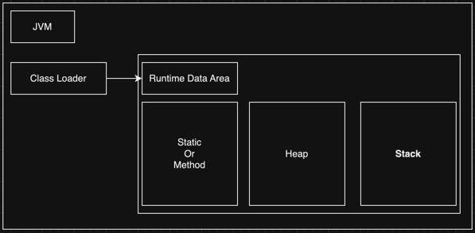
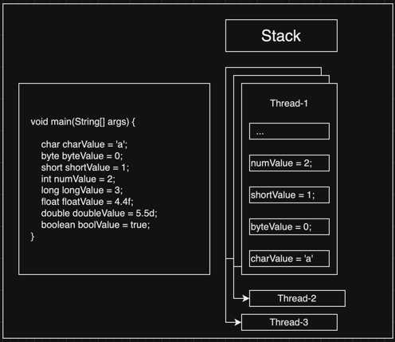
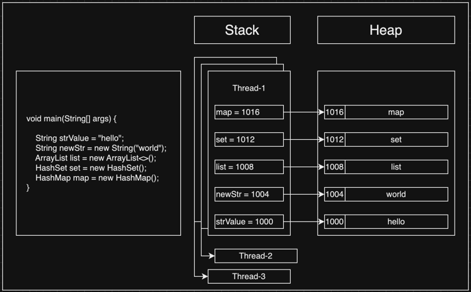

# JVM Memory

<br/><br/><br/>


## Index
* [Runtime Data Area](#Runtime-Data-Area)
* [Stack](#Stack)
* [Heap](#Heap)
---

<br/><br/><br/>


## Runtime Data Area

### Runtime Data Area 영역
* Static Or Method
* Heap
* Stack



Runtime Data Area 는 말 그대로 실행 환경에서의 데이터를 관리하는 영역이다.  
Java가 실행하게 되면 main 메서드의 args매개변수를 통해 값을 읽어 메모리에 할당한다.  

이때 먼저 static 변수와 클래스 메서드등은 Static Or Method 영역에 할당이 되며,  
Primitive Type은 Stack에 할당이 되고  
Reference Type은 Heap에 데이터가 저장되며, Stack에 변수가 등록되고 Heap 데이터에 대한 주소 값을 참조한다.

```java
class Main {
    
    public static void main(String[] args) { // # 실행 환경에서의 필요한 변수들을 Runtime Data Area에 추가한다. 
        
    }
}
```

<br/><br/><br/>


## Stack



JVM의 Runtime Data Area(메모리 공간)에서  
Primitive Type과 Reference Type의 변수를 저장한다.

1 스레드당 1 Stack을 할당 받는다.  

```java
public class StackMemory {

    public static void main(String[] args) {

        /**
         * Stack Memory
         * --------------------
         * -> Thread 1 : 1 Stack
         * -> 1 쓰레드당 1 스텍을 할당 받는다.
         * -> Stack은 Primitive 데이터들과 Heap의 주소를 참조하는 Reference 변수를 들고 있다.
         */

        // primitive types
        char charValue = 'c';
        byte byteValue = 0;
        short shortValue = 1;
        int intValue = 2;
        long longValue = 3;
        float floatValue = 4.4f;
        double doubleValue = 5.5d;
        boolean boolValue = true;
    }
}
```

<br/><br/><br/>


## Heap



JVM의 Runtime Data Area(메모리 공간)에서  
Reference Type의 주소값과 실제 값을 저장한다.  

Heap의 주소 값을 Stack에 있는 Reference 변수가 참조한다.

```java
public class HeapMemory {

    public static void main(String[] args) {

        /**
         * Heap Memory
         * --------------------
         * -> Thread n : 1 Heap
         * -> 쓰레드가 여러개여도(Stack n) 하나의 힙만 생성 된다.
         * -> Heap은 Reference들의 값과 주소를 가지고 있다.
         * -> Stack에서 Reference Type에 대한 주소 값을 Heap에서 참조 한다.
         */

        // Immutable
        String strValue = "hello world";
        String strValueTwo = "hello world";
        String strIsImmutable = new String("String is Immutable");

        /**
         *       strValue : 1794106052
         *    strValueTwo : 1794106052
         * strIsImmutable : -400615045
         */
        System.out.println("      strValue : " + strValue.hashCode());
        System.out.println("   strValueTwo : " + strValueTwo.hashCode());
        System.out.println("strIsImmutable : " + strIsImmutable.hashCode());

        ArrayList list = new ArrayList<>();
        HashSet set = new HashSet();
        HashMap map = new HashMap();
    }
}
```

<br/><br/><br/>